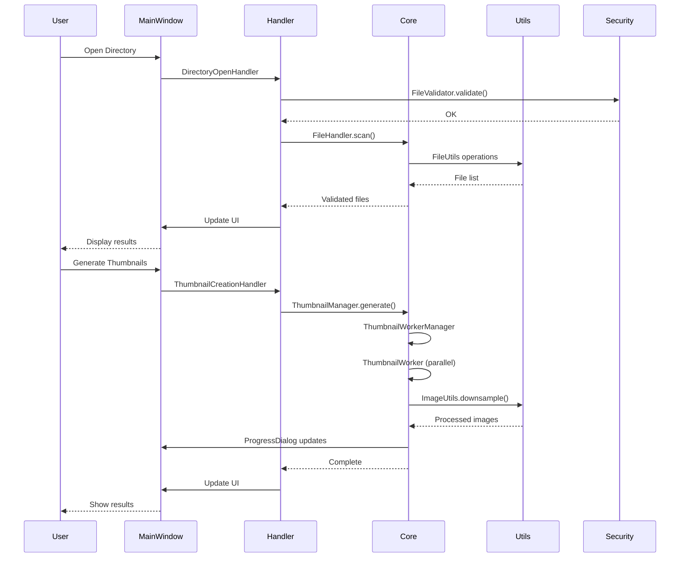
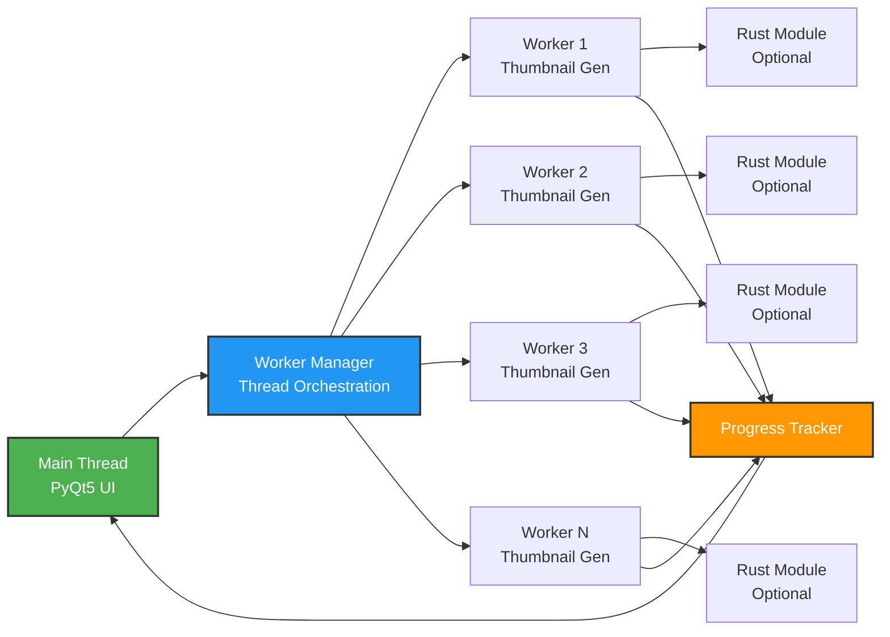
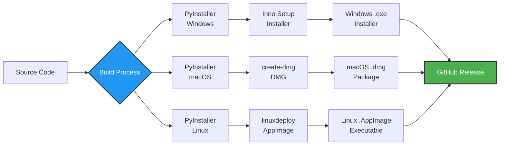
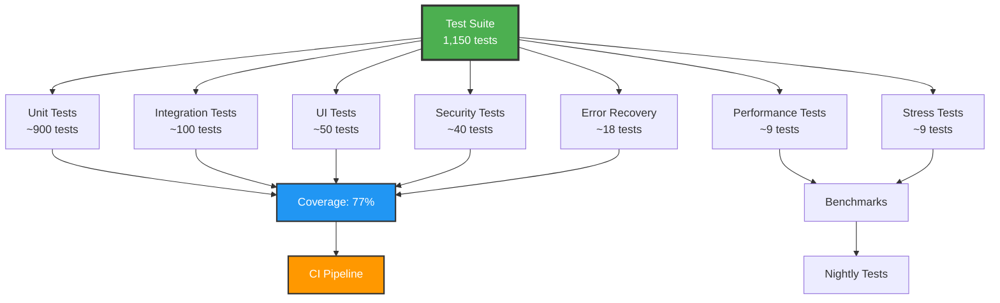
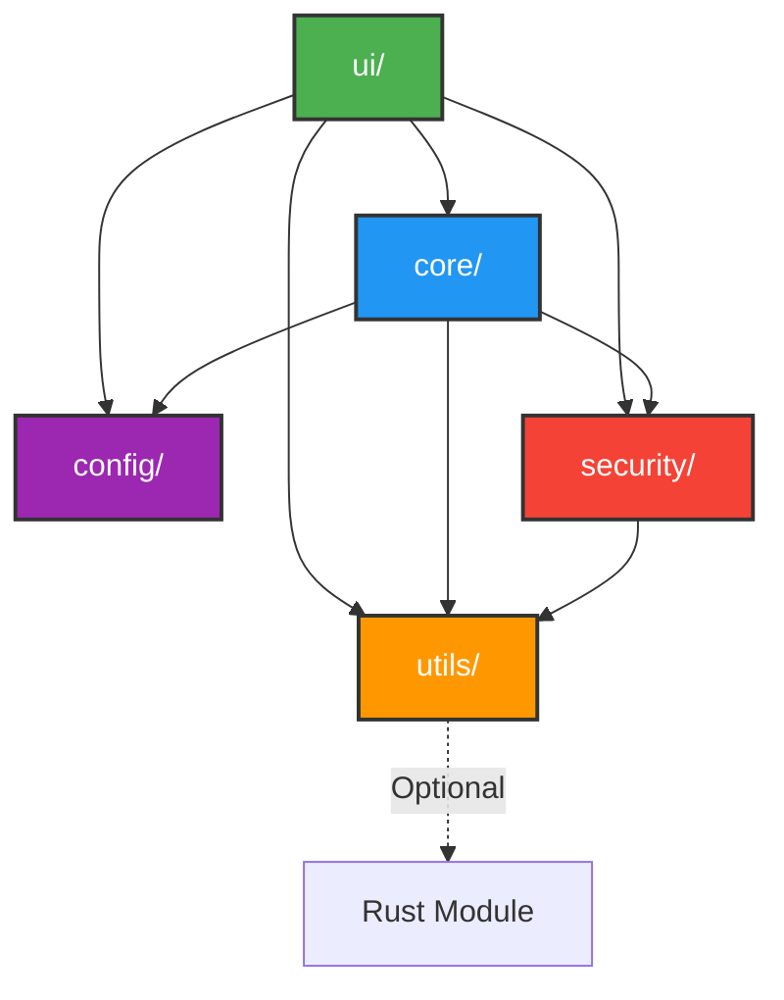

# CTHarvester Architecture

**Version:** 0.2.3-beta.1
**Last Updated:** 2025-10-08

## Overview

CTHarvester is a PyQt5-based desktop application for processing CT scan images. The architecture follows a layered pattern with clear separation of concerns.

---

## System Architecture

```mermaid
graph TB
    subgraph "UI Layer (PyQt5)"
        MW[MainWindow<br/>main_window.py]

        subgraph "Dialogs"
            PD[ProgressDialog]
            SD[SettingsDialog]
            ID[InfoDialog]
            SHD[ShortcutDialog]
        end

        subgraph "Widgets"
            OV[ObjectViewer2D]
            MC[MCubeWidget]
            VS[VerticalStackSlider]
            RM[ROIManager]
        end

        subgraph "Handlers"
            DOH[DirectoryOpenHandler]
            TCH[ThumbnailCreationHandler]
            EH[ExportHandler]
            SH[SettingsHandler]
            VM[ViewManager]
        end
    end

    subgraph "Core Layer (Business Logic)"
        TM[ThumbnailManager<br/>thumbnail_manager.py]
        TG[ThumbnailGenerator<br/>thumbnail_generator.py]
        VP[VolumeProcessor<br/>volume_processor.py]
        FH[FileHandler<br/>file_handler.py]

        subgraph "Workers"
            TWM[ThumbnailWorkerManager]
            TW[ThumbnailWorker]
            SP[SequentialProcessor]
        end

        subgraph "Progress Tracking"
            PM[ProgressManager]
            PT[ProgressTracker]
            TPT[ThumbnailProgressTracker]
        end
    end

    subgraph "Utils Layer (Utilities)"
        IU[ImageUtils<br/>image_utils.py]
        FU[FileUtils<br/>file_utils.py]
        TE[TimeEstimator]
        PL[PerformanceLogger]
        SM[SettingsManager]
        EM[ErrorMessages]
    end

    subgraph "Security Layer"
        FV[FileValidator<br/>file_validator.py]
    end

    subgraph "Config Layer"
        CONF[Constants]
        I18N[i18n]
        SC[Shortcuts]
        TT[Tooltips]
        UIS[UIStyle]
        VM2[ViewModes]
    end

    subgraph "External Dependencies"
        PYQT[PyQt5]
        PIL[Pillow/PIL]
        NP[NumPy]
        RUST[Rust Module<br/>Optional]
    end

    %% UI Layer connections
    MW --> DOH
    MW --> TCH
    MW --> EH
    MW --> SH
    MW --> VM
    MW --> PD
    MW --> SD
    MW --> ID
    MW --> SHD
    MW --> OV
    MW --> MC
    MW --> VS
    MW --> RM

    %% Handlers to Core
    DOH --> FH
    DOH --> FV
    TCH --> TM
    EH --> VP
    SH --> SM

    %% Core Layer connections
    TM --> TG
    TM --> TWM
    TM --> PM
    TG --> IU
    TG --> RUST
    VP --> IU
    FH --> FV
    FH --> FU
    TWM --> TW
    TW --> TG
    SP --> TG

    %% Progress tracking
    PM --> PT
    PM --> TPT
    PT --> PD

    %% Utils connections
    IU --> PIL
    IU --> NP

    %% Config connections
    MW --> CONF
    MW --> I18N
    MW --> SC
    MW --> TT
    MW --> UIS
    MW --> VM2

    %% External dependencies
    MW --> PYQT

    style MW fill:#4CAF50,stroke:#333,stroke-width:3px,color:#fff
    style TM fill:#2196F3,stroke:#333,stroke-width:3px,color:#fff
    style TG fill:#2196F3,stroke:#333,stroke-width:2px,color:#fff
    style FV fill:#f44336,stroke:#333,stroke-width:2px,color:#fff
```



---

## Layer Descriptions

### 1. UI Layer (PyQt5)

**Responsibility:** User interface and user interaction

**Main Components:**
- **MainWindow** - Primary application window, coordinates all UI components
- **Dialogs** - Modal dialogs for progress, settings, info, shortcuts
- **Widgets** - Custom PyQt5 widgets for visualization and interaction
- **Handlers** - Business logic handlers triggered by UI events

**Key Files:**
- `ui/main_window.py` - Main application window
- `ui/dialogs/` - Dialog components
- `ui/widgets/` - Custom widgets
- `ui/handlers/` - Event handlers

---

### 2. Core Layer (Business Logic)

**Responsibility:** Application business logic and data processing

**Main Components:**

#### Thumbnail Processing
- **ThumbnailManager** - Orchestrates thumbnail generation workflow
- **ThumbnailGenerator** - Core thumbnail generation logic (Python/Rust)
- **ThumbnailWorkerManager** - Manages worker threads
- **ThumbnailWorker** - Individual worker thread

#### Volume Processing
- **VolumeProcessor** - 3D volume processing and export

#### File Management
- **FileHandler** - File system operations, sequence detection

#### Progress Tracking
- **ProgressManager** - Manages progress tracking
- **ProgressTracker** - Base progress tracker
- **ThumbnailProgressTracker** - Specialized for thumbnails

**Key Files:**
- `core/thumbnail_*.py` - Thumbnail processing
- `core/volume_processor.py` - Volume processing
- `core/file_handler.py` - File operations
- `core/progress_*.py` - Progress tracking

---

### 3. Utils Layer (Utilities)

**Responsibility:** Reusable utility functions

**Main Components:**
- **ImageUtils** - Image processing utilities (PIL, NumPy)
- **FileUtils** - File system utilities
- **TimeEstimator** - ETA calculation with smoothing
- **PerformanceLogger** - Performance monitoring
- **SettingsManager** - Application settings persistence
- **ErrorMessages** - User-friendly error messages

**Key Files:**
- `utils/image_utils.py` - Image operations
- `utils/file_utils.py` - File operations
- `utils/time_estimator.py` - Time estimation
- `utils/performance_logger.py` - Performance tracking
- `utils/settings_manager.py` - Settings management

---

### 4. Security Layer

**Responsibility:** Security validation and protection

**Main Components:**
- **FileValidator** - Path traversal prevention, file validation

**Key Files:**
- `security/file_validator.py` - Security validation

---

### 5. Config Layer

**Responsibility:** Application configuration and constants

**Main Components:**
- **Constants** - Application-wide constants
- **i18n** - Internationalization (English/Korean)
- **Shortcuts** - Keyboard shortcuts (24 shortcuts)
- **Tooltips** - Tooltip definitions (100% coverage)
- **UIStyle** - UI styling (8px grid system)
- **ViewModes** - View mode configurations

**Key Files:**
- `config/constants.py` - Constants
- `config/i18n.py` - Translations
- `config/shortcuts.py` - Keyboard shortcuts
- `config/tooltips.py` - Tooltip texts
- `config/ui_style.py` - UI styling
- `config/view_modes.py` - View configurations

---

## Data Flow



---

## Threading Model



**Thread Safety:**
- Main thread handles all UI operations (PyQt5 requirement)
- Worker threads process thumbnails in parallel
- Progress updates via thread-safe signals/slots
- No shared mutable state between workers

---

## Performance Optimization

### Parallel Processing
- Multi-threaded thumbnail generation
- Automatic worker count (CPU cores)
- Work queue distribution

### Memory Management
- Batch processing for large datasets
- Explicit resource cleanup
- Memory monitoring (PerformanceLogger)

### Optional Rust Module
- ~50ms per image (vs 100-200ms Python)
- 2-4x performance improvement
- Fallback to Python if unavailable

---

## Error Handling Architecture

```mermaid
graph TD
    ERR[Error Occurs] --> CAT{Categorize}
    CAT -->|File System| FS[FileSystemError]
    CAT -->|Image Processing| IP[ImageProcessingError]
    CAT -->|Security| SEC[SecurityError]
    CAT -->|UI| UI[UIError]

    FS --> LOG[Log Error]
    IP --> LOG
    SEC --> LOG
    UI --> LOG

    LOG --> USR{User-facing?}
    USR -->|Yes| MSG[ErrorMessages.get_message()]
    USR -->|No| INT[Internal logging only]

    MSG --> DLG[User Dialog]
    INT --> FILE[Log file]

    DLG --> REC{Recoverable?}
    REC -->|Yes| RETRY[Offer retry/skip]
    REC -->|No| ABORT[Graceful abort]

    style ERR fill:#f44336,stroke:#333,stroke-width:2px,color:#fff
    style MSG fill:#4CAF50,stroke:#333,stroke-width:2px,color:#fff
    style REC fill:#FF9800,stroke:#333,stroke-width:2px,color:#fff
```

**Error Categories:**
1. **File System Errors** - Permission, not found, OS errors
2. **Image Processing Errors** - Corrupt, invalid format
3. **Security Errors** - Path traversal, validation failures
4. **UI Errors** - Widget failures, display issues

**Recovery Strategy:**
- Graceful degradation
- User-friendly error messages
- Detailed logging for debugging
- Skip/retry options where appropriate

---

## Security Architecture

### Defense Layers

1. **Input Validation** (FileValidator)
   - Path traversal prevention
   - Filename validation
   - Extension whitelist

2. **File System Security**
   - Sandbox directory operations
   - Permission checks
   - Secure path resolution

3. **Dependency Security**
   - Bandit static analysis
   - pip-audit vulnerability scanning
   - CodeQL SAST
   - Dependency review on PRs

---

## Build & Deployment



**Platforms:**
- Windows: Inno Setup installer
- macOS: DMG with app bundle
- Linux: AppImage (universal)

**Dependencies Bundled:**
- Python 3.11+ runtime
- PyQt5 libraries
- NumPy, Pillow
- Optional Rust module

---

## Testing Architecture



**Test Coverage:**
- **Core modules:** ~85-90%
- **UI modules:** ~70-75%
- **Utils modules:** ~75-85%
- **Security modules:** ~80%

**CI Strategy:**
- Quick tests (~1,113) on every PR
- Full tests (~1,150) nightly + tags
- Parallel execution (2-3x faster)

---

## Configuration Management

### Settings Hierarchy

1. **Application Defaults** (`config/constants.py`)
2. **User Settings** (JSON file, persisted)
3. **Runtime Settings** (in-memory)

### Settings Categories

- **UI Settings** - Theme, layout, window size
- **Processing Settings** - Thread count, quality, batch size
- **Path Settings** - Last used directories
- **View Settings** - Zoom, pan, view mode

---

## Internationalization (i18n)

**Supported Languages:**
- English (default)
- Korean (한국어)

**Translation Mechanism:**
- Qt's translation system (`.ts` files)
- `config/i18n.py` - Language switching
- UI text externalized from code

---

## Performance Characteristics

### Benchmarks

| Dataset | Size | Images | Time | Memory |
|---------|------|--------|------|--------|
| Small | 512×512 | 10 | <1s | <150 MB |
| Medium | 1024×1024 | 100 | ~7s | <200 MB |
| Large | 2048×2048 | 500 | ~188s | <3 GB |

**Scaling:**
- Linear time complexity: O(n) images
- Constant memory per batch
- CPU-bound workload (parallelizable)

---

## Future Architecture Considerations

### Potential Enhancements

1. **Plugin System**
   - Extensible processing pipeline
   - Custom filters/operations

2. **Cloud Integration**
   - Remote storage support
   - Distributed processing

3. **Database Backend**
   - Metadata indexing
   - Query capabilities

4. **REST API**
   - Headless operation
   - Integration with other tools

5. **GPU Acceleration**
   - CUDA/OpenCL support
   - Faster image processing

---

## Technology Stack

### Core Technologies
- **Python:** 3.11+
- **GUI Framework:** PyQt5
- **Image Processing:** Pillow (PIL), NumPy
- **Optional:** Rust (maturin)

### Build Tools
- **Packaging:** PyInstaller
- **Installers:** Inno Setup (Win), create-dmg (Mac), linuxdeploy (Linux)

### CI/CD
- **Platform:** GitHub Actions
- **Testing:** pytest, pytest-cov, pytest-qt
- **Quality:** black, isort, flake8, pylint, mypy
- **Security:** bandit, pip-audit, CodeQL

---

## Appendix: Module Dependency Graph



**Dependency Rules:**
- UI depends on all layers
- Core depends on Utils, Security, Config
- Utils and Security are independent
- No circular dependencies
- Clear layering hierarchy

---

**Document Version:** 1.0
**Created:** 2025-10-08
**Author:** Development Team
**Status:** Production Ready
